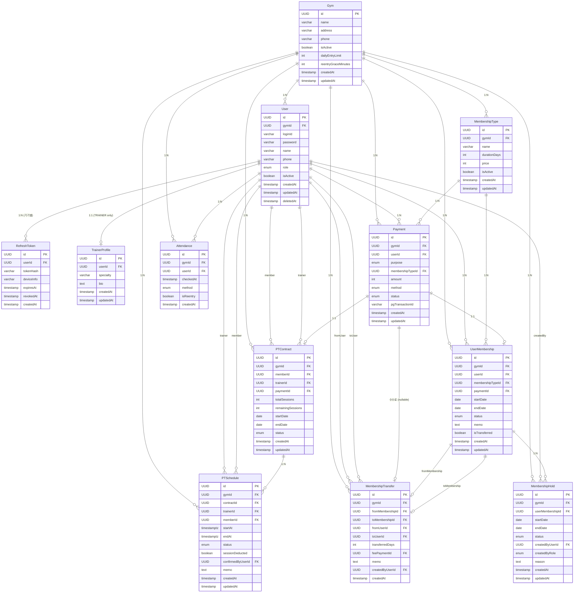

# DB 모델링 — gym-manager

## 개요

> **필요한 PostgreSQL 확장**: `btree_gist` (PT 예약의 시간 겹침 제약)
> 애플리케이션이 부팅할 때 `dataSourceFactory`가 설치한다. → [[아키텍처#5. 데이터베이스]]

- **DB**: PostgreSQL 16 (Docker)
- **ORM**: TypeORM
- **PK 전략**: UUID (열거 공격 방지) → ADR-002
- **테넌시**: 행 단위 분리. 주요 테이블에 `gymId` FK → ADR-004
- **Soft Delete**: User 테이블만 적용 (`deletedAt`), 나머지는 `status`로 관리

---

## 역할 체계

| 역할 | 성격 | gymId | 설명 |
|------|------|-------|------|
| SUPER_ADMIN | 개인 | **null** | 서비스 운영자. 헬스장 등록, OWNER 계정 발급 |
| OWNER | **공용 운영 계정** | 필수 | 헬스장 운영 전반. 프론트 데스크에서 직원 공유 |
| TRAINER | 개인 | 필수 | PT 일정/계약이 귀속되는 개인 계정 |
| MEMBER | 개인 | 필수 | 일반 회원 |

→ 상세 근거: ADR-005

---

## ERD



> **`UserMembership`이 양도의 양쪽에 두 번 걸린다.**
> 양도인의 원본과 양수인의 신규는 **서로 다른 레코드**이고,
> `MembershipTransfer`가 그 둘을 잇는 유일한 연결이다.

---

## 테이블 상세

### Gym (테넌트)
| 컬럼 | 타입 | 제약 | 설명 |
|------|------|------|------|
| id | UUID | PK | |
| name | VARCHAR(100) | NOT NULL | 헬스장 이름 |
| address | VARCHAR(255) | | |
| phone | VARCHAR(20) | | |
| isActive | BOOLEAN | DEFAULT true | 서비스 이용 여부 (구독 해지 시 false) |
| **dailyEntryLimit** | INT | nullable | 하루 입장 가능 횟수. `null`이면 무제한 |
| **reentryGraceMinutes** | INT | DEFAULT 0 | 이 시간 안의 재스캔은 같은 입장. `0`이면 재출입 미사용 |
| createdAt | TIMESTAMP | | |
| updatedAt | TIMESTAMP | | |

> **헬스장별 운영 정책이 들어오기 시작한 자리다.**
> QR의 역할이 헬스장마다 다르다. 데스크가 있고 기록용으로만 찍는 곳과,
> QR을 찍어야 문이 열리는 24시 무인 헬스장은 필요한 동작이 다르다.
>
> ```
> reentryGraceMinutes = 0     형식적 스캔형. 매 스캔이 새 입장
> reentryGraceMinutes = 30    출입 통제형. 흡연 후 재입장을 인정
> ```
>
> **on/off 플래그를 따로 두지 않는다.** `0`이 곧 "사용 안 함"이다.
> 불리언을 추가하면 `enabled=false, minutes=30` 같은 모순된 조합이 저장된다. → ADR-013

> 정책 필드가 더 늘어나면 `GymPolicy`로 분리한다. 2개뿐일 때 테이블을 나누는 것은
> 조인만 늘리고 얻는 게 없다.

### User
| 컬럼 | 타입 | 제약 | 설명 |
|------|------|------|------|
| id | UUID | PK | |
| gymId | UUID | FK → Gym, **nullable** | SUPER_ADMIN만 null |
| loginId | VARCHAR(50) | **UNIQUE** NOT NULL | 로그인 아이디. 4~20자, 영소문자·숫자·`_` |
| password | VARCHAR(255) | NOT NULL | bcrypt 해시 |
| name | VARCHAR(50) | NOT NULL | |
| phone | VARCHAR(20) | | |
| role | ENUM | NOT NULL | SUPER_ADMIN \| OWNER \| TRAINER \| MEMBER |
| address | VARCHAR(255) | nullable | 회원 조회 화면에 노출 |
| birthDate | DATE | nullable | |
| memo | TEXT | nullable | 회원 전반의 특이사항. 결제 건별 기록은 UserMembership.memo |
| isActive | BOOLEAN | DEFAULT true | 계정 활성 여부 |
| createdAt | TIMESTAMP | | |
| updatedAt | TIMESTAMP | | |
| deletedAt | TIMESTAMP | | soft delete |

> **왜 email이 아니라 loginId인가**: 이메일 인증을 넣지 않기로 한 이상
> 검증되지 않은 이메일을 받는 것은 의미가 없다. 헬스장 도메인에서 실질 연락 수단은 `phone`이다.
> 비밀번호 분실은 상위 역할이 초기화하는 방식으로 해결한다. → ADR-009

> **loginId 유니크 범위**: 전역 유니크로 결정.
> `(gymId, loginId)` 복합 유니크로 하면 한 사람이 여러 헬스장에 가입할 수 있지만,
> 로그인 시 헬스장을 먼저 선택해야 해서 UX가 복잡해진다.
> MVP에서는 **한 계정 = 한 헬스장**으로 단순화한다.

### RefreshToken
| 컬럼 | 타입 | 제약 | 설명 |
|------|------|------|------|
| id | UUID | PK | |
| userId | UUID | FK → User NOT NULL | |
| tokenHash | VARCHAR(64) | UNIQUE NOT NULL | **SHA-256** 해시 (bcrypt 아님) |
| deviceInfo | VARCHAR(255) | nullable | User-Agent 요약. 기기 목록 표시용 |
| expiresAt | TIMESTAMP | NOT NULL | 발급 시각 + 30일 |
| revokedAt | TIMESTAMP | nullable | 폐기 시각. Reuse Detection용 |
| createdAt | TIMESTAMP | | |

> **왜 SHA-256인가**: bcrypt는 인덱스 조회가 불가능해 userId로 후보를 모두 가져와 순회 비교해야 한다.
> Refresh Token은 서버가 만든 고엔트로피 값이라 bcrypt의 느린 해싱이 주는 이점이 없다.
> SHA-256은 결정적이라 `tokenHash` 인덱스로 단일 조회가 가능하다.
> **비밀번호는 계속 bcrypt를 쓴다.** 용도가 다르다.

> **왜 삭제하지 않고 revokedAt으로 표시하는가**: 폐기된 토큰이 다시 제출되면 탈취로 판단해야 하는데,
> row를 지워버리면 "정상 만료"와 "재사용 공격"을 구분할 수 없다. → ADR-006

### TrainerProfile
| 컬럼 | 타입 | 제약 | 설명 |
|------|------|------|------|
| id | UUID | PK | |
| userId | UUID | FK → User UNIQUE | role=TRAINER인 User만 |
| specialty | VARCHAR(100) | | 전문 분야 |
| bio | TEXT | | 소개글 |
| createdAt | TIMESTAMP | | |
| updatedAt | TIMESTAMP | | |

> gymId 없음. User와 1:1이므로 항상 User를 경유해 접근한다.

### MembershipType
| 컬럼 | 타입 | 제약 | 설명 |
|------|------|------|------|
| id | UUID | PK | |
| gymId | UUID | FK → Gym NOT NULL | |
| name | VARCHAR(100) | NOT NULL | 판매 명칭. 예: "헬스 3개월" |
| **category** | VARCHAR(50) | NOT NULL | 회원권 성격. 예: "헬스", "락커", "운동복" |
| durationDays | INT | NOT NULL | 유효 기간(일) |
| price | INT | NOT NULL | 가격(원) |
| holdingLimit | INT | DEFAULT 0 | 홀딩 가능 횟수. 0이면 홀딩 불가 |
| holdingMaxDays | INT | DEFAULT 14 | 1회 홀딩당 최대 일수 |
| isActive | BOOLEAN | DEFAULT true | 판매 여부. 삭제 대신 이 값을 false로 |
| createdAt | TIMESTAMP | | |
| updatedAt | TIMESTAMP | | |

> **`category`가 자동 이어붙이기의 판단 기준이다.**
> 같은 카테고리의 회원권을 추가로 부여하면 기존 종료일 다음날부터 시작된다.
> 헬스와 락커는 카테고리가 달라 동시에 진행된다.
>
> enum이 아닌 자유 문자열인 이유: 헬스장마다 취급 종류가 다르다.
> "운동복과 수건을 나눌지 합칠지"도 각 헬스장이 정한다. → ADR-010

### Payment
| 컬럼 | 타입 | 제약 | 설명 |
|------|------|------|------|
| id | UUID | PK | |
| gymId | UUID | FK → Gym NOT NULL | |
| userId | UUID | FK → User | 구매 회원 |
| **purpose** | ENUM | NOT NULL | MEMBERSHIP \| PT_CONTRACT \| TRANSFER_FEE |
| membershipTypeId | UUID | FK → MembershipType **nullable** | `MEMBERSHIP`일 때만 채워진다 |
| amount | INT | NOT NULL | 결제 금액 |
| method | ENUM | DEFAULT MANUAL | MANUAL \| KAKAO_PAY \| TOSS |
| status | ENUM | DEFAULT PENDING | PENDING \| COMPLETED \| FAILED \| REFUNDED |
| pgTransactionId | VARCHAR(255) | nullable | PG 연동 시 채워짐 |
| createdAt | TIMESTAMP | | |
| updatedAt | TIMESTAMP | | |

> **`purpose`가 없으면 매출을 나눌 수 없다.**
> `membershipTypeId`가 null인 것만으로는 PT 계약인지 양도 수수료인지 구분되지 않는다.
>
> ```sql
> SELECT purpose, SUM(amount) FROM payments
>  WHERE gym_id = ? AND created_at >= ?
>  GROUP BY purpose
> ```

> **처음에는 `membershipTypeId`가 NOT NULL이었다.**
> 그래서 #20의 양도 수수료가 원본 회원권의 종류를 그대로 넣어 우회했고,
> **수수료 5만원이 "헬스 12개월" 매출로 집계되고 있었다.**
> PT 계약을 만들면서 같은 벽에 부딪혀 #26에서 정리했다.

> **기본값을 두지 않는다.** `default: MEMBERSHIP`을 주면
> `purpose`를 빼먹어도 조용히 회원권 매출로 잡힌다.
> `SUSPENDED`·홀딩 자동 종료·PT 자정 일괄 처리를 걷어낸 것과 같은 판단이다.

### UserMembership
| 컬럼 | 타입 | 제약 | 설명 |
|------|------|------|------|
| id | UUID | PK | |
| gymId | UUID | FK → Gym NOT NULL | |
| userId | UUID | FK → User | |
| membershipTypeId | UUID | FK → MembershipType | |
| paymentId | UUID | FK → Payment nullable | 부여 시 함께 생성 (트랜잭션) |
| startDate | DATE | NOT NULL | 미지정 시 서버가 계산 (이어붙이기) |
| endDate | DATE | NOT NULL | **`startDate + durationDays - 1`**. 마지막 이용 가능일 |
| status | ENUM | DEFAULT ACTIVE | ACTIVE \| CANCELLED \| TRANSFERRED |
| memo | TEXT | nullable | 결제 건별 자유 기록. 예: `*26.08.06 H12 + 락커12 [카 55만]` |
| **isTransferred** | BOOLEAN | DEFAULT false | 양도로 생성됨. 홀딩 불가 |
| createdAt | TIMESTAMP | | |
| updatedAt | TIMESTAMP | | |

> **`status`에는 사람이 개입한 사건만 담는다.**
> 시간이 지나면 저절로 바뀌는 사실은 넣지 않는다.
>
> | 질문 | 어떻게 답하나 |
> |------|--------------|
> | 만료됐나? | `endDate < 오늘` → ADR-010 |
> | 홀딩 중인가? | `MembershipHold` + 날짜 → ADR-011 |
> | 취소됐나? | `status` |
> | 양도됐나? | `status` |
>
> 같은 사실을 두 곳에 저장하면 갱신이 한 번만 실패해도 영구히 어긋난다.
> 그래서 `EXPIRED`도, `SUSPENDED`도 두지 않는다.

> **`TRANSFERRED`는 삭제 대신이다.** 양도한 원본을 지우면
> 양도인 이력에서 회원권이 사라져 "12개월 끊었었다"를 확인할 수 없다. → ADR-012

> **`isTransferred`가 `status`와 별개인 이유**:
> `status`는 *이 회원권에 무슨 일이 있었나*(양도인 쪽),
> `isTransferred`는 *이 회원권이 어떻게 생겼나*(양수인 쪽)를 가리킨다.
> 양수인의 회원권은 멀쩡히 `ACTIVE`이면서 동시에 양도로 생긴 것이다.

> **`SUSPENDED`는 제거됐다 (#22).** 설계 초기의 정지/해제 흔적이었는데
> `MembershipHold` 테이블이 역할을 가져가면서 참조 0건의 죽은 값이 됐다.
> 값에 "홀딩(휴회)"이라는 주석까지 붙어 있어 오해를 부를 소지가 컸다.

> **`-1`이 필요한 이유**: 1일권을 오늘 시작하면 오늘 하루만 유효해야 한다.
> `startDate + durationDays`면 이틀이 된다.

> **한 회원이 여러 건을 동시에 보유할 수 있다.**
> 헬스 + 락커(카테고리 다름), 헬스 잔여 3일 + 헬스 12개월(이어붙임)

### MembershipHold
| 컬럼 | 타입 | 제약 | 설명 |
|------|------|------|------|
| id | UUID | PK | |
| gymId | UUID | FK → Gym NOT NULL | |
| userMembershipId | UUID | FK → UserMembership | |
| startDate | DATE | NOT NULL | 홀딩 시작일 |
| endDate | DATE | NOT NULL | 마지막 홀딩일 |
| status | ENUM | DEFAULT ACTIVE | ACTIVE \| CANCELLED |
| createdByUserId | UUID | FK → User | 실제 등록한 계정 |
| createdByRole | ENUM | NOT NULL | MEMBER(셀프) \| OWNER(데스크 대행) |
| reason | TEXT | nullable | |
| createdAt / updatedAt | TIMESTAMP | | |

> **회원권 종료일은 이 이력에서 파생된다.**
> ```
> UserMembership.endDate = startDate + durationDays - 1 + (ACTIVE 홀딩의 총 일수)
> ```
> 홀딩을 만들거나 고치거나 취소할 때마다 **처음부터 다시 계산**한다.
> 증분 조정(+10 했다가 -5)은 수정이 반복되면 어긋난다. → ADR-011

> **진행 상태(예정/진행중/완료)를 저장하지 않는다.** 날짜로 판단한다.
> `CANCELLED`만 사람이 개입한 상태다. 회원권 만료와 같은 원리다.

> **`createdByRole`을 남기는 이유**: 회원이 앱에서 직접 걸었는지
> 데스크가 대신 걸었는지는 분쟁 시 서로 다른 사실이다.

**인덱스**

| 인덱스 | 이유 |
|--------|------|
| (userMembershipId, status) | 종료일 재계산 시 매번 사용 |
| (gymId, startDate, endDate) | "홀딩 중", "오늘 종료 예정" 목록 |

### MembershipTransfer
| 컬럼 | 타입 | 제약 | 설명 |
|------|------|------|------|
| id | UUID | PK | |
| gymId | UUID | FK → Gym NOT NULL | |
| fromMembershipId | UUID | FK → UserMembership | 양도인의 원본. `TRANSFERRED`가 된다 |
| toMembershipId | UUID | FK → UserMembership | 양수인에게 새로 만들어진 것 |
| fromUserId | UUID | FK → User | 양도인 |
| toUserId | UUID | FK → User | 양수인 |
| transferredDays | INT | NOT NULL | 실제로 넘긴 일수. **홀딩 정리 후 확정값** |
| feePaymentId | UUID | FK → Payment nullable | 수수료 결제. 무료면 null |
| memo | TEXT | nullable | 예: `가족 양도` |
| createdByUserId | UUID | FK → User | 처리한 직원 계정 |
| createdAt | TIMESTAMP | | |

> **회원권 두 건을 잇는 것이 이 테이블의 존재 이유다.**
> 원본의 `userId`만 바꾸면 테이블 하나로 끝나지만,
> 그러면 양도인 이력에서 회원권이 통째로 사라진다. → ADR-012

> **`transferredDays`를 저장한다.** 계산으로 복원할 수 있는 값이지만,
> 양수인의 회원권은 이후 연장·홀딩으로 기간이 바뀐다.
> **양도 시점에 몇 일을 넘겼는지는 그때만 알 수 있는 사실이다.**

> **`feePaymentId`는 수수료만 가리킨다.** 원본 결제를 복제하지 않는다.
> 복제하면 같은 돈이 매출에 두 번 잡힌다.
> 같은 이유로 양수인의 `UserMembership.paymentId`는 `null`이다.

**홀딩 처리 순서** — 순서가 바뀌면 잔여 일수가 틀린다.

```
① 진행 중 홀딩을 어제까지로 단축 (취소 아님)
② endDate 재계산
③ 잔여 일수 확정
④ 이전
```

③을 먼저 하면 아직 정리되지 않은 홀딩 일수까지 넘어간다. 전부 한 트랜잭션이다.

**인덱스**

| 인덱스 | 이유 |
|--------|------|
| (gymId, createdAt) | 헬스장의 양도 이력 목록 |
| fromUserId | 이 회원이 넘긴 것 |
| toUserId | 이 회원이 받은 것 |

> 양도 이력 조회는 "준 것 + 받은 것"을 함께 보여준다.
> 한쪽 방향만 인덱스하면 반대쪽이 풀스캔이 된다.

### Attendance
| 컬럼 | 타입 | 제약 | 설명 |
|------|------|------|------|
| id | UUID | PK | |
| gymId | UUID | FK → Gym NOT NULL | |
| userId | UUID | FK → User | |
| checkedAt | TIMESTAMP | NOT NULL | 실제 출석 시각 |
| method | ENUM | NOT NULL | QR \| MANUAL |
| **isReentry** | BOOLEAN | DEFAULT false | 유예 시간 안의 재입장. **입장 횟수에 세지 않는다** |
| createdAt | TIMESTAMP | | |

> **입장 이벤트만 쌓는다.** 퇴실은 기록하지 않는다.
> 퇴실 스캔 기능이 있어도 회원 대부분이 그냥 나가기 때문에
> **재실 인원이 항상 실제보다 많게 나온다.** 신뢰할 수 없는 데이터는 없느니만 못하다.
>
> `입장 → 입장 → 입장`이 정상이다. → ADR-013 결정 3

```
08:10  홍길동  isReentry=false   ← 입장 1회
08:35  홍길동  isReentry=true    ← 흡연 후 재입장. 횟수 미차감. 로그는 남음
19:20  홍길동  isReentry=false   ← 입장 2회
```

> **재입장도 행으로 남기는 이유**: 무인 24시 헬스장은 사고 발생 시
> 누가 언제 안에 있었는지가 필요하다. 컬럼 하나로 로그를 온전히 남기면서
> 횟수는 `isReentry = false`만 세면 정확하다.

> **`type: ENTRY | EXIT` enum을 미리 만들지 않는다.**
> 값이 하나뿐인 enum이 생기고 다음 사람이 "왜 EXIT를 안 쓰지?"에서 막힌다.
> `MembershipStatus.SUSPENDED`가 정확히 그 사례였다(#22).
> 나중에 필요해지면 `exitedAt`을 nullable로 붙이면 된다.

**인덱스**

| 인덱스 | 이유 |
|--------|------|
| (gymId, userId, checkedAt) | 당일 입장 횟수 계산 — 스캔할 때마다 실행된다 |
| (gymId, checkedAt) | 출석률 통계, 일자별 조회 |

> **첫 번째 인덱스는 조회용이 아니라 쓰기 경로에 있다.**
> 스캔 1회마다 "오늘 이 회원이 몇 번 들어왔나"를 세야 하므로
> 이 인덱스가 없으면 출석이 느려진다. 출입구에서의 지연은 곧 대기줄이다.

### PTContract
| 컬럼 | 타입 | 제약 | 설명 |
|------|------|------|------|
| id | UUID | PK | |
| gymId | UUID | FK → Gym NOT NULL | |
| memberId | UUID | FK → User | 회원 (role=MEMBER) |
| trainerId | UUID | FK → User | 담당 트레이너. **1:1 전속** |
| paymentId | UUID | FK → Payment | 계약이 곧 결제다 |
| totalSessions | INT | NOT NULL | 총 PT 횟수 |
| remainingSessions | INT | NOT NULL | 잔여 횟수 → ADR-003 |
| startDate | DATE | NOT NULL | |
| endDate | DATE | NOT NULL | |
| status | ENUM | DEFAULT ACTIVE | ACTIVE \| COMPLETED \| CANCELLED |
| createdAt / updatedAt | TIMESTAMP | | |

> **트레이너는 계약 시 배정되고 1:1로 고정된다.** 변경은 이례적이라 향후 과제로 미뤘다.

> **`remainingSessions`를 저장하는 이유가 조회 성능만은 아니다.**
> 집계로 계산하면 항상 정확하지만, **조건부 UPDATE의 대상이 사라진다.**
> ```sql
> UPDATE … SET remaining = remaining - 1 WHERE remaining > 0
> ```
> 집계값에는 이 원자적 검사를 걸 수 없다. 세고 나서 판단하는 사이가 비어 있다. → ADR-014

### PTSchedule
| 컬럼 | 타입 | 제약 | 설명 |
|------|------|------|------|
| id | UUID | PK | |
| gymId | UUID | FK → Gym NOT NULL | |
| contractId | UUID | FK → PTContract | 어느 계약에서 차감할지 |
| trainerId | UUID | FK → User | |
| memberId | UUID | FK → User **NOT NULL** | 빈 슬롯이 없으므로 항상 있다 |
| startAt | TIMESTAMPTZ | NOT NULL | |
| endAt | TIMESTAMPTZ | NOT NULL | |
| status | ENUM | DEFAULT SCHEDULED | SCHEDULED \| COMPLETED \| NO_SHOW \| CANCELLED |
| sessionDeducted | BOOLEAN | DEFAULT false | 횟수를 깎았는지 |
| confirmedByUserId | UUID | FK → User nullable | 누가 확정했나 |
| memo | TEXT | nullable | |
| createdAt / updatedAt | TIMESTAMP | | |

> **행 하나 = 예약 하나. 빈 슬롯 테이블이 없다.**
> 처음에는 "트레이너가 슬롯을 열고 회원이 고른다"로 설계했으나
> **빈 슬롯을 소비할 화면이 없다.** 예약은 대화로 정하고 트레이너가 입력한다.
> 개념이 둘이 되면 동기화 문제만 생긴다 — 슬롯을 지웠는데 예약이 붙어 있으면?
> → ADR-014 결정 1

> **`status`와 `sessionDeducted`를 분리한다.**
> 노쇼를 차감할지는 트레이너 재량이라 헬스장·사유마다 다르다.
>
> | 조합 | 상황 |
> |------|------|
> | `NO_SHOW` + 차감 | 규정대로 |
> | `NO_SHOW` + 미차감 | 봐줬다. **노쇼 이력은 남는다** |
> | `CANCELLED` + 미차감 | 사전 취소 |
>
> 하나로 합치면 "노쇼 3회 이상 경고" 같은 기능을 나중에 못 만든다.

**시간 겹침 제약**

```sql
CREATE EXTENSION IF NOT EXISTS btree_gist;

ALTER TABLE pt_schedules ADD CONSTRAINT no_trainer_overlap
  EXCLUDE USING gist (
    trainer_id WITH =,
    tstzrange(start_at, end_at, '[)') WITH &&
  ) WHERE (status <> 'CANCELLED');
```

> **`btree_gist` 확장이 필요하다.** `trainer_id`는 UUID **등호** 비교,
> 시간은 **범위** 비교인데 GiST는 원래 범위·기하 타입용이라 UUID 등호를 모른다.
> 없으면 `data type uuid has no default operator class for access method "gist"`.
> 설치 순서는 → [[아키텍처#초기화 순서 — 확장이 스키마보다 먼저다]]

> **`[)`는 끝을 포함하지 않는 범위다.**
> 닫아두면(`[]`) 19:00~20:00과 20:00~21:00이 서로를 밀어낸다.
> 실제로는 50분 수업이 많아 경계가 잘 맞닿지 않지만, 문자 두 개라 비용이 없다.

> **`WHERE status <> 'CANCELLED'`가 없으면 취소해도 그 시간이 영영 막힌다.**
> 취소한 자리에 다시 잡는 것은 당연히 되어야 한다.

> **UNIQUE가 "값이 같으면 거부"라면 EXCLUDE는 "범위가 겹치면 거부"다.**
> 트레이너가 같은 시간에 두 회원을 잡는 것을 **DB가 막는다.** 애플리케이션 코드가 필요 없다.
>
> MySQL에는 없는 기능이라 보통은 락을 걸고 조회해 판단한다.
> `ADR-001`에서 PostgreSQL을 고른 근거(JSONB·배열)를 **실제로 뽑아 쓰는 첫 지점이다.**

**인덱스**

| 인덱스 | 이유 |
|--------|------|
| (gymId, trainerId, startAt) | 트레이너의 오늘·이번주 일정 |
| (gymId, memberId, startAt) | 회원의 다음 수업, 이력 |
| (gymId, status, endAt) | **미확인 목록** — `endAt < now AND status = SCHEDULED` |

> EXCLUDE 제약이 만드는 GiST 인덱스는 겹침 검사용이라
> 일반 조회에는 위 B-tree 인덱스가 따로 필요하다.

---

## 인덱스 전략

멀티테넌시 구조이므로 **모든 복합 인덱스의 선두 컬럼은 `gymId`** 로 둔다.
대부분의 쿼리가 `WHERE gym_id = ?` 로 시작하기 때문이다.

| 테이블 | 인덱스 | 이유 |
|--------|--------|------|
| User | loginId (UNIQUE) | 로그인 조회 |
| User | (gymId, role) | 헬스장별 트레이너/회원 목록 |
| RefreshToken | tokenHash (UNIQUE) | 토큰 검증 시 단일 조회 |
| RefreshToken | (userId, revokedAt) | 전체 로그아웃, 기기 목록 |
| RefreshToken | expiresAt | 만료분 정리 |
| MembershipType | (gymId, isActive) | 판매 중인 회원권 목록 |
| UserMembership | (gymId, userId, status) | 회원별 활성 회원권 |
| UserMembership | (gymId, endDate) | 만료 임박 회원 조회 (알림용) |
| MembershipHold | (userMembershipId, status) | 종료일 재계산 시 매번 사용 |
| MembershipHold | (gymId, startDate, endDate) | "홀딩 중", "오늘 종료 예정" 목록 |
| MembershipTransfer | (gymId, createdAt) | 헬스장 양도 이력 |
| MembershipTransfer | fromUserId / toUserId | 준 것 / 받은 것 |
| Attendance | (gymId, userId, checkedAt) | **당일 입장 횟수 계산 — 스캔마다 실행** |
| Attendance | (gymId, checkedAt) | 출석률 통계 |
| Payment | (gymId, createdAt) | 매출 통계 |
| PTSchedule | (gymId, trainerId, startAt) | 트레이너의 오늘·이번주 일정 |
| PTSchedule | (gymId, memberId, startAt) | 회원의 다음 수업, 이력 |
| PTSchedule | (gymId, status, endAt) | 미확인 목록 |
| PTSchedule | EXCLUDE gist (trainerId, 시간범위) | **시간 겹침 원천 차단** |
| PTContract | (gymId, memberId) | 회원별 계약 |
| PTContract | (gymId, trainerId) | 트레이너별 계약 |

---

## 주요 설계 결정 요약

| 항목 | 결정 | ADR |
|------|------|-----|
| DB | PostgreSQL | ADR-001 |
| PK | UUID | ADR-002 |
| PT 잔여 횟수 | 컬럼 저장 + 트랜잭션 원자 처리 | ADR-003 |
| 멀티테넌시 | 행 단위 분리, 주요 테이블에 gymId | ADR-004 |
| OWNER 계정 | 공용 운영 계정 (개인 계정과 분리) | ADR-005 |
| Refresh Token | 별도 테이블 + SHA-256 + Rotation + Reuse Detection | ADR-006 |
| 토큰 유효기간 | Access 1시간 / Refresh 30일 | ADR-006 |
| 로그인 식별자 | `loginId` (이메일 아님). email 컬럼 없음 | ADR-009 |
| 회원권 만료 | `status`에 두지 않고 `endDate`로 계산 | ADR-010 |
| 회원권 이어붙이기 | 같은 `category`의 마지막 종료일 다음날부터 | ADR-010 |
| 홀딩 | 별도 테이블 + 종료일 전체 재계산 (증분 조정 아님) | ADR-011 |
| 양도 | 원본을 `TRANSFERRED`로 종료 + 신규 발급 + 연결 테이블 | ADR-012 |
| 출석 | 입장 이벤트만 누적. 퇴실 없음. 재입장은 `isReentry`로 구분 | ADR-013 |
| 헬스장별 정책 | Gym에 컬럼으로. 2개를 넘어가면 `GymPolicy`로 분리 | ADR-013 |
| PT 예약 | 빈 슬롯 없음. 행 하나 = 예약 하나 | ADR-014 |
| PT 시간 겹침 | 애플리케이션이 아니라 **PostgreSQL EXCLUDE 제약** | ADR-014 |
| PT 동시성 | 조건부 UPDATE + affected rows. 락·재시도 없음 | ADR-014 |
| 결제 분류 | `purpose`로 구분. 기본값 없음 | ADR-014 |
| 알림 | **기능 자체를 제거.** 만료 필터 조회로 대체 | ADR-015 |

> 테이블 총 **12개**: Gym, User, RefreshToken, TrainerProfile, MembershipType, Payment,
> UserMembership, MembershipHold, MembershipTransfer, Attendance, PTContract, PTSchedule

> **회원권 도메인이 4개 테이블로 늘어난 것이 이 프로젝트의 핵심 설계다.**
> 처음에는 `UserMembership` 하나에 `status`로 정지까지 담으려 했다.
> 실제 헬스장 운영을 조사하면서 **홀딩과 양도가 각각 독립된 이력**이라는 걸 알게 됐고,
> 상태값 하나로는 "언제 며칠 홀딩했는지", "누구에게 넘겼는지"를 남길 수 없었다.
> → 도메인 지식.md
